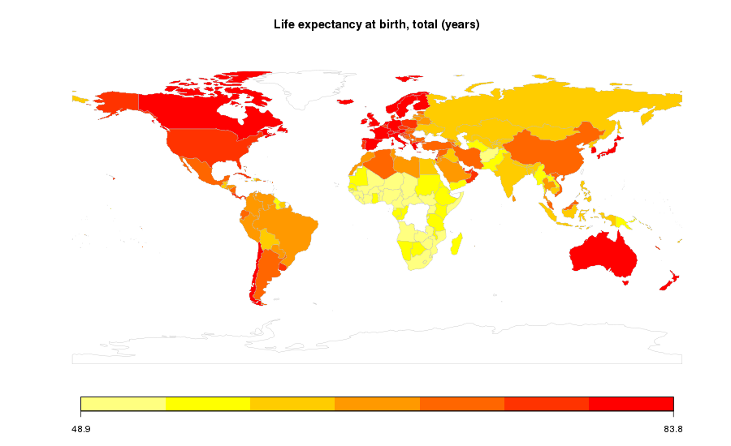

# Project2

Group Proposal 
Eileen, Mark, Luciana, Ian 

* Must include:  
Visualization: Python flask + power RESTful API, HTML/CSS, JavaScript, and one database (MongoDB) 
Tracks: Web scraping, Leaflet and Plotly, and Dashboard page with multiple charts (update from the same data)
One JS library (not covered in class):  React or Angular
Dataset (at least 100 records): worldbank (CSV): databank.worldbank.org
Link to Github repo:  https://github.com/Mpalmese/Project2
Some User-driven interactions: menus, dropdowns, textboxes, etc.  
Final visualizations: map, table, histogram
Dataset link (API): worldbank API: https://datahelpdesk.worldbank.org/knowledgebase/articles/898590-country-api-queries

**Screenshots of relevant and inspiring visualizations and of the metadata:

* Topic and rationale:  

The purpose of the research is to look at the global life expectancy within the past 20 years. Does socioeconomic status (income level) impact life expectancy. With further examination, we can determine if life expectancy changes over time. 
